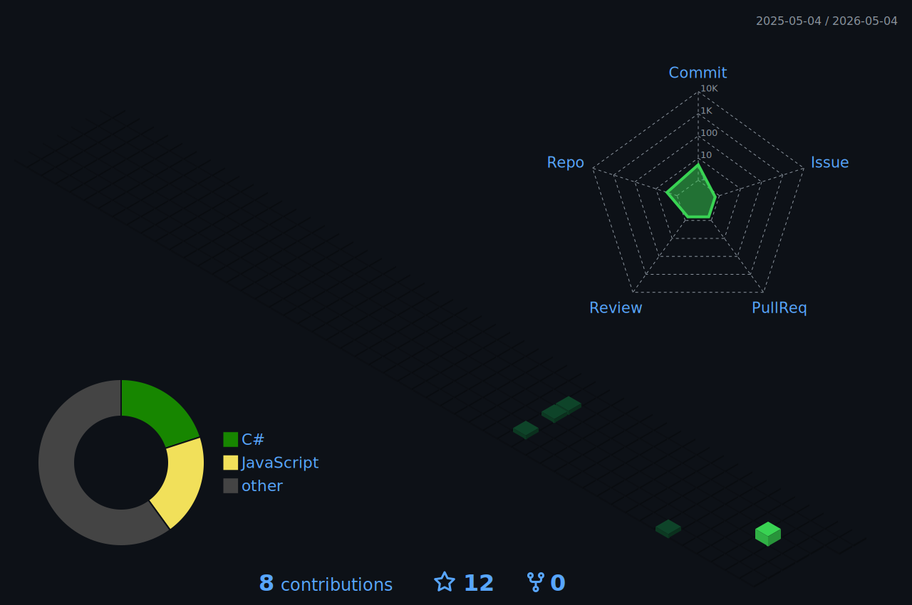

 

---

### ⚙️ Stack

  
  
  
  
  

  
  
  
  
  
  

  
  
  
  

---

### 📊 Metrics

  
  

  

---

### 🏆 Trophies

  

---

### 🌐 3D Contribution Graph

  

---

### 🚀 Highlighted Engineering

| Project | Description | Tech |
|---------|-------------|------|
| **[QubitsJS](https://github.com/Marcus-Johnson/qubits)** | NISQ-era sparse-matrix quantum simulator — OpenQASM, Quil, Azure Quantum |  |
| **[RexGT](https://github.com/Marcus-Johnson/RexGT)** | AI-powered app — 4 models, 500+ categories, real-time text, image, speech |  |
| **[smart-pool](https://github.com/Marcus-Johnson/smart-pool)** | High-performance priority promise pool with concurrency control |  |
| **[Ultan](https://github.com/Marcus-Johnson/Ultan)** | Utility functions collection for modern JavaScript projects |  |
| **[Astrodex](https://github.com/Marcus-Johnson/Astrodex)** | Scenario-based rocket launch, flight, mission & landing procedures |  |

---

### 🐍 Contribution Snake

  <picture>
    <source media="(prefers-color-scheme: dark)" srcset="./github-contribution-grid-snake-dark.svg"/>
    <source media="(prefers-color-scheme: light)" srcset="./github-contribution-grid-snake.svg"/>
    
  </picture>

---

